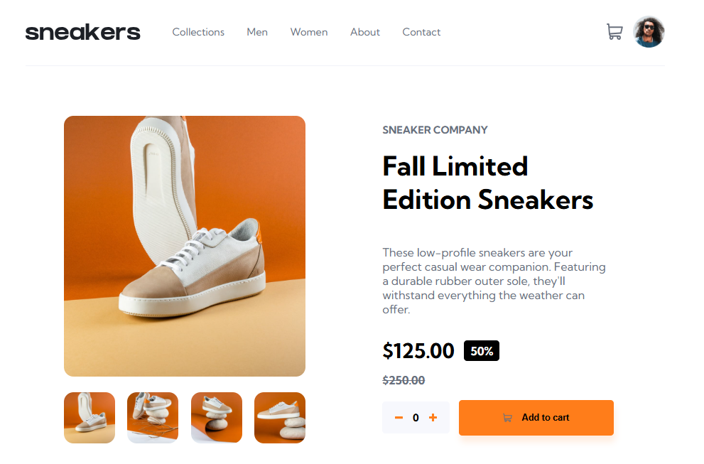

# 🚀 E-comerce Product Page

Página de um e-comerce com fotos e informações sobre um produto.

---

## 🎨 Layout

<div align="center">
  
  
  [Acesse o Projeto Online](URL_DO_GITHUB_PAGES)</br>
  [Acesse o Repositório do Projeto](URL_DO_REPOSITORIO)</br>
  [Reportar Bug](URL_DO_REPOSITORIO/issues)</br>
  
</div>

---

## 💻 Sobre o Projeto

Este projeto foi desenvolvido com o objetivo de criar uma interface de e-comerce com todos os elementos principais desse tipo de plataforma. Através dele, busquei aplicar os seguintes conceitos a fim de elaborar uma solução eficiente e intuitiva para o usuário:

- HTML: tags semânticas.
- CSS: estilização de elementos.
- CSS: criação de layouts responsivos (dispositivos móveis, tablets e desktop).
- Javascript: manipulação do DOM.
- Javascript: eventos.
- Javascript: estrutura de módulos.
- Javascript: renderização condicional.

### ✨ Principais Funcionalidades:
- **Thumbnails/Miniaturas:** Miniaturas de imagens do produto que ao serem clicadas são exibidas em um formato maior dinamicamente.
- **Menu lateral:** Menu retrátil disponível em telas de dispositivos móveis e tablets.
- **Lightbox:** Modal que exibe as imagens do produto em primeiro plano na tela.

---

## 🛠 Tecnologias Utilizadas

As seguintes ferramentas e linguagens foram utilizadas na construção deste projeto:

- **Linguagem Principal:** JavaScript.
- **Estrutura e Estilização:** HTML e CSS.
- **Versionamento:** Git e GitHub.
- **Hospedagem:** GitHub Pages.

---

## 🚀 Como Executar o Projeto

Caso queira rodar este projeto localmente na sua máquina, siga os passos abaixo:

```bash
# 1. Clone este repositório
$ git clone https://github.com/seu-usuario/nome-do-projeto.git

# 2. Acesse a pasta do projeto
$ cd nome-do-projeto

# 3. Instale as dependências (se houver)
$ npm install

# 4. Execute a aplicação
$ npm run dev (ou abra o index.html no navegador)
```

---

## 🤝 Colaboradores 
Um agradecimento especial a todas as pessoas que contribuíram para este projeto.

<table>
  <tr>
    <td align="center">
      <a href="#">
        <br>
        <sub>
          <b>Marina Pereira</b>
        </sub>
      </a>
    </td>
  </tr>
</table>

---

## 📫 Contribuir
Deixe sua contribuição nesse projeto.
1. Clone o repositório.
2. Faça o checkout para sua branch usando a sintaxe:
    - Feature (Adicionar nova funcionalidade)
    - Bugfix (Correção de bug)
    - Improvement (Melhoria)
3. Siga os padrões de commit.
4. Abra um Pull Request explicando seu trabalho realizado e aguarde a revisão! 🤝